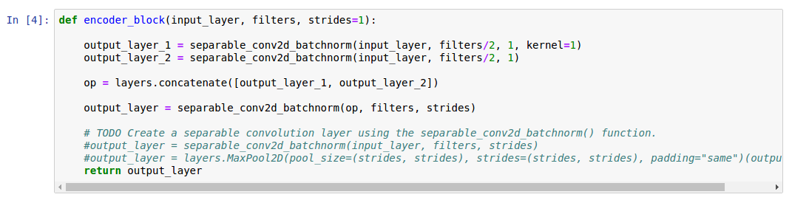
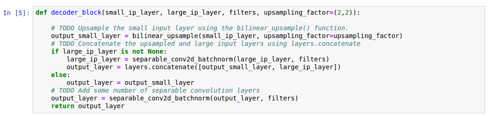
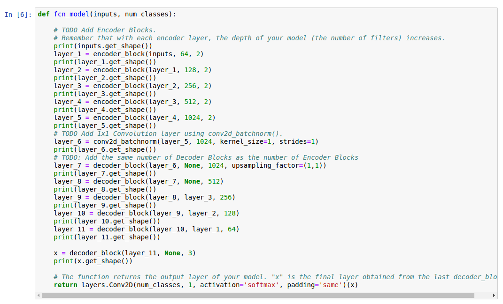
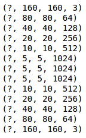
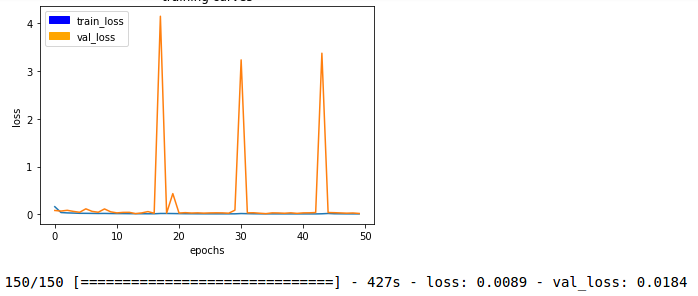
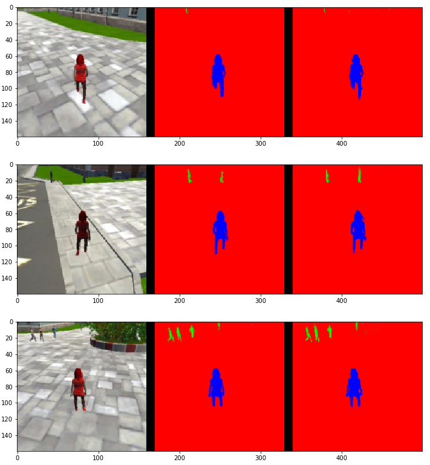
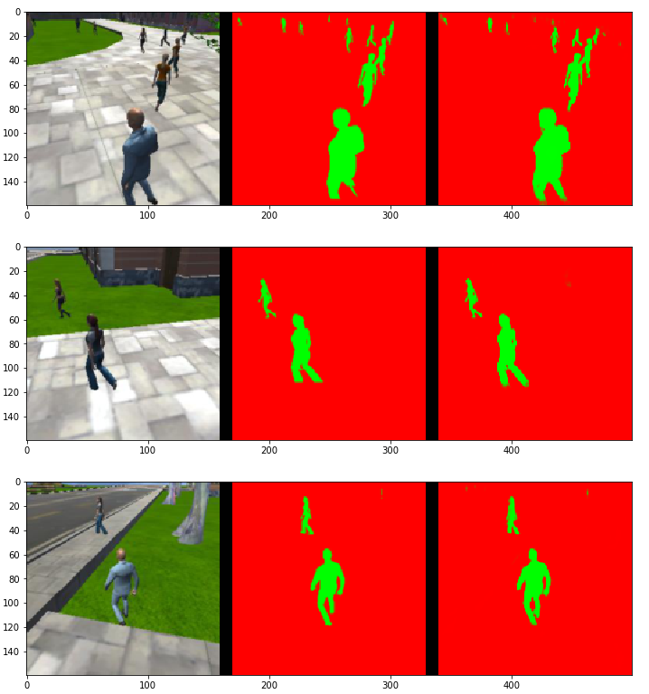
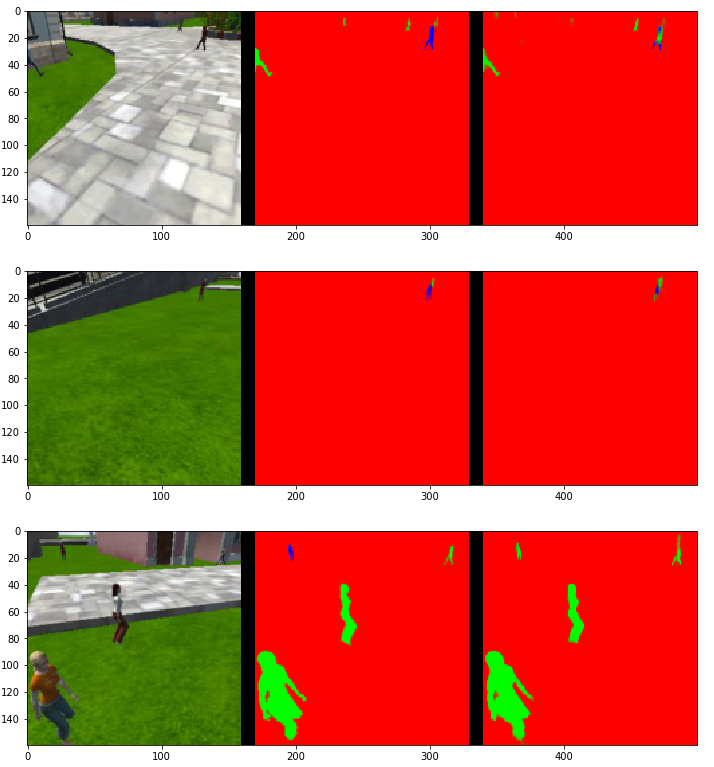
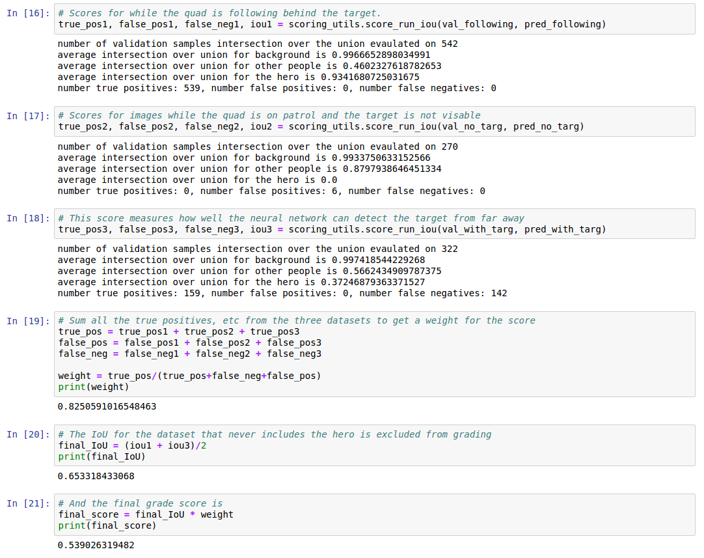

### Writeup 

#### 1. General
I gained a lot of experience for training by working with the different labs available for Neural Networks, Deep Learning and Convolutional Neural Networks. Since I had a 4GB GTX 860 on my laptop, I had the opportunity to experiment a lot with the parameters and network architecture before running the final training. For final few experiments I decided to do it on an AWS server instance.

For testing on my laptop, I decided to run each of the test network architecture and parameter for 15 epochs, as the graph for the loss function seemed to somewhat stabalize by that time. I started with a barebones network with 2 encoder layers, one 1x1 convolution layer and 2 decoder layers, and kept increasing the complexity and experimenting with parameters.

As I increased the layers, added 1x1 convolutions and skip connections, the model started showing slight improvements, but because of limits of my laptop, I had to decrease the batch size as complexity increased. 

For the initial test of parameters, I started with a batch size of 64, increased and decreased the batch sized a little bit, and soon realised that higher batch sizes gave better results and faster convergence. For some more complex architectures I had to decrease batch size to 48.

For learning rate, I started with 0.1, which seemed to be too high, as the loss function was giving a very sharp graph with a lot of sudden and high changes. After a bit of experimenting, I decided to settle on a value of 0.02.

I also decided to record some extra training data using the simulator and added about 4k more images (and masks) to test data and 1k more data to validation set. 

#### 2. Network Architecture
A fully convolutional networks are generally divded into 3 parts, encoder layers, 1x1 convolution and decoder layers. 

I will start the discussion with encoder layers, initially each encoder layer consisted of a separable 2D convolution with a kernel size of 3, and a stride of 2 in both direction with same padding. While experimenting, I realised, as I increased the number of encoder and layers, the network started showing improvements, but it came with a drawback of increased training time, and changing the batch sizes showed quite a lot of variance as the network got larger, but because of limited resources on my laptop, batch sizes had to be decreased for larger models. After adding initial few layers, the network showed quite a bit of improvement, but after a point it started giving diminishing returns and required very high training time. A network similar to the FCN architecture (without a pretrained VGGNet) was giving a grade score slightly higher than 30%. So I decided to experiment a little with the architecture of each encoder layer, I started with adding an extra 1x1 convolution to each encoder layer before the separable 2D convolution of kernel size 3x3, and a smaller networks started showing much better results than FCN like model. I decided to experiment a bit with the inception module that was mentioned earlier in the course, so for each layer I added a 1x1 convolution for half the output filters and a 2D convolution with kernel size 3 and stride 1 for the other half, concatenated them used them as input for a 2D convolution with kernel size 3x3 and stride of 2. This showed a very significant improvement, and the network gave scores of more than 40%. 

Each encoder layer

For the decoder layer, I initially just used bilinear upsampling and randomly placed 1 skip connection by concantenating the corresponding layer from encoder part, I later adjusted the skip connections to see better results. By seeing an improvement by using 1x1 convolutions while encoding, I decided to add that for the skip connections. This gave results much greater than 40%. 

Each decoder layer

For final training I increased the batch size to 100, and trained for 50 epochs. I again played a little around with the hyperparameters while doing the final training on the server to get the best results. 

For deciding the number of layers and filter sizes, I used the FCN8 network architecture as inspiration and tried the filter sizes in the powers of 2. While the final training on the server, I had to make a choice between increasing the number of encoder and decoder layers or increasing the batch size, since increasing the batch size was giving better results, I decided to go with that. 

For skip connections, I experimented by adding them to all the later decoder layers, they were most rewarding for the decoder layers towards the end, except the last one, as the last one was adding a lot of noise.

Final model

Size of each layer

#### 3. Hyperparameters
For parameter tuning, I ran quite a few experiments, I changed every parameter while keeping the others the same, and I experimented more with the parameters which were more rewarding when changed.

For initial testing I took number of epochs as 15, as most of the complex models seemed to be fitting well by that point, and almost had a straight line in loss functions, by this point I can get an approx estimate about the usefulness of the model, and if the characteristics being tested in the model should be used for further models. For final model, I increased the epochs to 50, to give it a better chance to fit.

Increasing the batch size was very rewarding, most of my testing was done on batch size of 64 (because of hardware limits), for more complex models, the batch size had to be reduced to 48. In the final few models trained on the server, I had to limit the batch size to 100.

Learning rate was a very important parameter, for very high learning rate, the loss function graph was fluctuating a lot, and for very slow, the model was taking a lot of time. I used 0.02 learning rate for training.

#### 4. Others
While training a network one might want to increase the number of trainable parameters, to better fit the model and avoid overfitting, this can be done by either using fully connected layers or 1x1 convolutions. 1x1 convolutions give an advantage of preserving spatial information, as opposed to fully connected layers. 

In the encoding step, we learn the various features for hero and background via filters. The decoding layer adds these learnt filters and places them accordingly to give us the desired results. 

The same model should work for other objects and scene of a similar variance and complexity, but a new set of data will be needed, as this model was specifically trained for our scene with a specific set of backgrounds and our "hero" (target). This model might not even work for another human (will have to be retrained according to the features of the new target). Another model can be trained with the weights of this model taken as initialisation weights, that will result in faster training.

#### 5. Results

The model does well when the target is not very small (i.e. not very far), the image masks are slightly pixelated. Both these can be avoided by taking the input image and concatenating it in the final decoder layer, a larger batch size might also be helpful. 
A deeper network may also be helpful, and a slightly more complex inception module might also be helpful.

Training: Loss function after 50 epochs

When following

When target is not in image

While patroling

Final results
